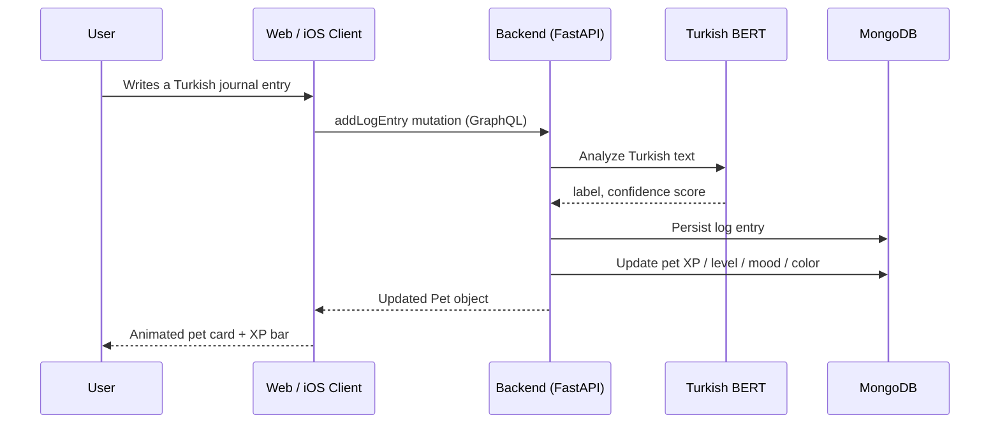

# 🐾 AuraPet

> **A digital pet ecosystem that evolves with your emotions.**

<p align="left">
  
  
  
  
  
  
  
  
</p>

AuraPet is a full-stack, cross-platform emotional journaling companion. You write a Turkish diary entry; a fine-tuned BERT model running on the backend analyzes your sentiment; your pet immediately reflects your inner state — changing mood, color theme, and earning XP toward the next level. The same GraphQL API powers both a Next.js web app and a native SwiftUI iOS client.

---

## ✨ Highlights

- **On-server Turkish NLP** — `saribasmetehan/bert-base-turkish-sentiment-analysis` (96.2% accuracy, 3-class) runs on Apple MPS / CPU at startup; the phone never needs the model
- **Real-time pet mutation** — a single `addLogEntry` mutation updates mood, color theme, XP, and level in one atomic pass
- **Gamified progression** — XP rewards emotional intensity (not just positivity), with 5 levels and a formula designed to encourage daily engagement
- **Shared GraphQL API** — web and iOS share identical queries & mutations; no code duplication across clients
- **Aurion design system** — custom SwiftUI vector pet (5 procedural shapes: Aether, Drift, Glimmer, Nova, Spark) with Lottie mood animations on both platforms
- **Sentiment trend charts** — Recharts (web) and the native Charts framework (iOS) visualize emotional history over time
- **Command palette** — `cmdk`-powered keyboard-first navigation on web (`⌘K`)
- **Light / dark theming** — `next-themes` (web) + `@AppStorage("aurapet_theme")` (iOS), respects system preference
- **163 passing tests** — pytest · vitest · XCTest, zero flakes, zero lint errors
- **CI/CD pipeline** — GitHub Actions runs backend + web + iOS on every push; pre-commit enforces code quality locally

---

## 🏗 Architecture



### Tech Stack

| Layer | Technology | Version |
|-------|-----------|---------|
| **Backend** | Python, FastAPI, Strawberry GraphQL, Motor (async MongoDB) | 0.115 / 0.243 / 3.7 |
| **AI / NLP** | PyTorch, HuggingFace Transformers, `saribasmetehan/bert-base-turkish-sentiment-analysis` | — |
| **Database** | MongoDB | 7+ |
| **Web** | Next.js (App Router), React, Apollo Client, Tailwind CSS v4, Framer Motion, Recharts, Lottie, Radix UI | 16.2 / 19.2 / 3.14 |
| **iOS** | Swift / SwiftUI, custom AuraGraphQL HTTP client, Charts, Lottie, Keychain | iOS 17+ |
| **Tooling** | ruff, mypy, black (backend) · ESLint, TypeScript, vitest (web) · XCTest, xcodebuild (iOS) | — |
| **CI/CD** | GitHub Actions (ubuntu-latest + macos-15), pre-commit | — |

---

## 🧠 Sentiment & Mood Engine

The backend classifies every journal entry into one of four moods using the raw model score:

| Mood | Emoji | Color | Hex | Score Range |
|------|-------|-------|-----|-------------|
| **HAPPY** | 😊 | Gold | `#FFD700` | `score > 0.25` |
| **NEUTRAL** | 😐 | Slate | `#95A5A6` | `-0.25 ≤ score ≤ 0.25` |
| **SAD** | 😢 | Blue | `#5B9BD5` | `-0.65 ≤ score < -0.25` |
| **ANXIOUS** | 😰 | Purple | `#9B59B6` | `score < -0.65` |

> `score` maps model confidence to `[-1.0, +1.0]`: positive → `+conf`, negative → `-conf`, neutral → `0.0`.

### XP Formula

```
xp_gain = 10 + abs(score) × 20   →   range: 10 – 30 XP per entry
```

XP rewards **emotional intensity**, not positivity — a deeply anxious day yields the same XP as an extremely happy one. Every entry earns at least 10 XP.

### Level Thresholds

| Level | Total XP Required |
|-------|------------------|
| 1 → 2 | 100 |
| 2 → 3 | 250 |
| 3 → 4 | 500 |
| 4 → 5 | 900 |
| **Max** | **5** |

---

## 🚀 Quick Start

### Prerequisites

| Requirement | Version |
|------------|---------|
| Python | 3.9+ |
| Node.js | 20+ |
| MongoDB | Running locally |
| Xcode | 16+ *(iOS only, optional)* |

### Run Everything

```bash
# 1. Start MongoDB
brew services start mongodb-community

# 2. Boot backend (:8000) + web (:3000) in one command
bash dev.sh
```

### Service URLs

| Service | URL |
|---------|-----|
| Web App | http://localhost:3000 |
| GraphQL Playground | http://localhost:8000/graphql |
| REST Health Check | http://localhost:8000/api/health |
| REST Analyze | `POST` http://localhost:8000/api/analyze |

### iOS

```bash
cd mobile-ios
xcodegen generate          # generates AuraPet.xcodeproj
open AuraPet.xcodeproj     # build & run on Simulator
```

> Point the app at `http://localhost:8000/graphql` for local development.

---

## 🧪 Testing & Quality

**163 tests across three platforms — all passing, zero flakes.**

| Platform | Runner | Count | Command |
|----------|--------|-------|---------|
| Backend | pytest | 56 | `cd backend && .venv/bin/pytest -v` |
| Web | vitest | 85 | `cd web && npm test -- --run` |
| iOS | XCTest | 22 | `xcodebuild test -scheme AuraPet -destination 'platform=iOS Simulator,name=iPhone 16 Pro,OS=latest'` |

<details>
<summary>Full quality check suite</summary>

```bash
# ── Backend ────────────────────────────────────────────────────────────
cd backend
source .venv/bin/activate
ruff check .            # 0 errors
mypy app                # 0 errors  (disallow_untyped_defs = true)
pytest -v               # 56 tests pass

# ── Web ────────────────────────────────────────────────────────────────
cd web
npm run lint            # ESLint
npx tsc --noEmit        # TypeScript strict check
npm test -- --run       # 85 vitest tests
npm run build           # production build

# ── iOS ────────────────────────────────────────────────────────────────
cd mobile-ios
xcodegen generate
xcodebuild test \
  -scheme AuraPet \
  -destination 'platform=iOS Simulator,name=iPhone 16 Pro,OS=latest'

# ── End-to-end smoke (backend must be running) ─────────────────────────
bash scripts/e2e-smoke.sh
```

</details>

**Pre-commit hooks** (`.pre-commit-config.yaml`) run ruff, mypy, ESLint, and Prettier automatically before every commit.

**GitHub Actions** (`.github/workflows/ci.yml`) runs all three test suites on every push — ubuntu-latest for backend/web, macos-15 for iOS.

---

## 📂 Project Structure

```
AuraPet/
├── backend/                        # FastAPI + Strawberry GraphQL
│   ├── app/
│   │   ├── api/                    # REST: GET /health, POST /analyze
│   │   ├── core/                   # pydantic-settings Config
│   │   ├── db/                     # Motor async MongoDB wrapper + indexes
│   │   ├── graphql/                # Schema, Query, Mutation resolvers
│   │   ├── models/                 # Pydantic documents (User, Pet, Log)
│   │   └── services/               # SentimentService (Turkish BERT singleton)
│   ├── tests/                      # 56 pytest tests — zero DB dependencies
│   └── pyproject.toml              # ruff + mypy + pytest-asyncio config
│
├── web/                            # Next.js 16 App Router
│   └── src/
│       ├── app/                    # Pages: login, dashboard, log, history
│       ├── components/
│       │   ├── ui/                 # Button, Card, Badge, EmptyState, …
│       │   ├── aurion/             # Shared Aurion Lottie + shape components
│       │   ├── MoodChart.tsx       # Recharts sentiment trend
│       │   ├── PetAvatar.tsx       # Lottie mood animation wrapper
│       │   ├── Sidebar.tsx         # Nav + command palette trigger
│       │   └── XpBar.tsx           # Framer Motion animated XP bar
│       ├── graphql/                # Apollo operations (queries + mutations)
│       └── lib/                    # Apollo client (errorLink), session, cn
│
├── mobile-ios/AuraPet/             # SwiftUI iOS client
│   ├── Components/
│   │   ├── Aurion/                 # AurionShape protocol + 5 vector shapes
│   │   ├── Controls/               # AuraButtonStyle, FloatingLabelField
│   │   ├── Display/                # AnimatedCounter, EmptyState, Skeleton, Toast, …
│   │   ├── Navigation/             # AuraTabBar, CommandSheet
│   │   └── Surfaces/               # AuroraBackground, Card, GlassCard
│   ├── Design/                     # Theme tokens: colors, spacing, typography,
│   │                               # radius, motion, haptics, elevation
│   ├── Models/                     # Pet, User, LogEntry, Mood, AurionForm
│   ├── Network/                    # ApolloClient, AuraPetAPI, Keychain, Session
│   │   └── Operations/             # GraphQL query strings
│   ├── Resources/Lottie/           # happy.json, neutral.json, sad.json, anxious.json
│   └── Views/                      # Dashboard, Log, History, Login, Splash, Settings
│
├── shared-docs/
│   ├── ARCHITECTURE.md             # Deep-dive system design
│   ├── DEPLOY.md                   # Production deployment guide
│   └── DEMO.md                     # Guided demo script
│
├── scripts/
│   └── e2e-smoke.sh                # End-to-end curl/jq smoke tests
├── .github/workflows/ci.yml        # GitHub Actions CI (3-platform)
├── .pre-commit-config.yaml         # Local pre-commit quality gates
└── dev.sh                          # One-command local dev bootstrap
```

---

## 🎬 Demo Flow

1. **Login** → `http://localhost:3000` — enter any username + email
2. **Dashboard** — pet is auto-created; Lottie animation plays for the current mood; animated XP bar shows progress toward the next level
3. **Add a journal entry** — write a Turkish sentence and watch your pet react:

   | Input | Mood | Color |
   |-------|------|-------|
   | `"Bugün harika hissediyorum!"` | 😊 HAPPY | Gold `#FFD700` |
   | `"Sıradan bir gündi."` | 😐 NEUTRAL | Slate `#95A5A6` |
   | `"Çok kötü hissediyorum."` | 😢 SAD | Blue `#5B9BD5` |
   | `"Her şeyden korkuyorum."` | 😰 ANXIOUS | Purple `#9B59B6` |

4. **History** → Recharts sentiment trend graph + full log list with mood chips
5. **iOS** → same data, same API, native SwiftUI experience with Aurion vector pet and Charts framework

---

## 🗺 Roadmap & Production Status

All three platforms are **feature-complete and fully tested** for local/demo use.

The following items remain before an actual App Store submission:

| Item | Status | Notes |
|------|--------|-------|
| App icon (1024×1024 PNG) | ⏳ Pending | Placeholder slot exists in `Assets.xcassets` |
| Apple Developer Team ID | ⏳ Pending | Set `DEVELOPMENT_TEAM` in `mobile-ios/project.yml` |
| Production HTTPS backend URL | ⏳ Pending | Set `AURAPET_GRAPHQL_URL` in Release scheme |
| JWT authentication | ⏳ Pending | `user_id` is currently passed as a GraphQL argument — known gap, documented in `shared-docs/DEPLOY.md` |

See [`shared-docs/DEPLOY.md`](shared-docs/DEPLOY.md) for the full production deployment guide.

---

## 📚 Further Reading

- [`shared-docs/ARCHITECTURE.md`](shared-docs/ARCHITECTURE.md) — system design deep-dive
- [`shared-docs/DEMO.md`](shared-docs/DEMO.md) — guided demo script for presentations

---

## 📄 License

[MIT](LICENSE) © Yiğit Erdoğan
