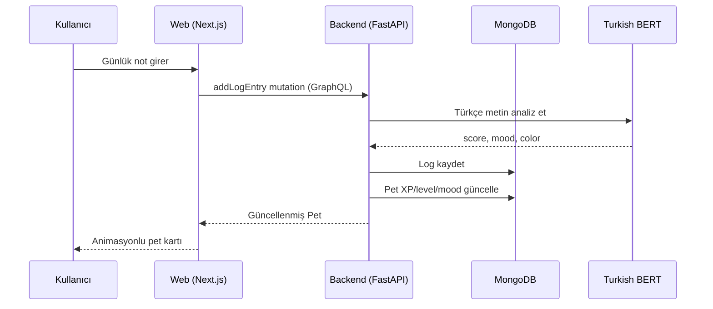

# 🐾 AuraPet

**Duygularınla evrilen dijital evcil hayvan ekosistemi.**

Kullanıcı günlük notlar yazar → Türkçe BERT modeli duyguyu analiz eder → evcil hayvan ruh halini, rengini, XP'sini ve seviyesini günceller.

---

## Mimari



**Teknolojiler:**

| Katman | Teknoloji |
|--------|-----------|
| Backend | Python 3.9+, FastAPI, Strawberry GraphQL, Motor (MongoDB async) |
| AI/NLP | HuggingFace `saribasmetehan/bert-base-turkish-sentiment-analysis` (MPS/CPU) |
| Veritabanı | MongoDB (localhost:27017, db: `aurapet`) |
| Web | Next.js 16, React 19, Apollo Client, Framer Motion, Recharts, Lottie |
| Mobil | Swift/SwiftUI, Charts framework, custom GraphQL HTTP client |

---

## 5 Dakikada Başlangıç

### Gereksinimler
- Python 3.9+, Node.js 20+
- MongoDB çalışıyor olmalı

### Kurulum & Çalıştırma

```bash
# 1. MongoDB başlat
brew services start mongodb-community

# 2. Her şeyi tek komutla başlat
bash dev.sh
```

| Servis | URL |
|--------|-----|
| Web | http://localhost:3000 |
| GraphQL API | http://localhost:8000/graphql |
| REST Health | http://localhost:8000/api/health |

### Testler

```bash
# Backend (38 test)
cd backend && source .venv/bin/activate && pytest -v

# Web (7 test)
cd web && npm test

# Uçtan uca smoke test (backend çalışırken)
bash scripts/e2e-smoke.sh
```

---

## Demo Akışı

1. `http://localhost:3000` → kullanıcı adı + email ile giriş
2. **Dashboard** — Pet otomatik oluşturulur, Lottie animasyonu + XP çubuğu
3. **Günlük Ekle** — Türkçe cümle yaz:
   - `"Bugün harika hissediyorum!"` → HAPPY 😊 (altın)
   - `"Sıradan bir gündi."` → NEUTRAL 😐 (gri)
   - `"Çok kötü hissediyorum."` → SAD 😢 (mavi)
   - `"Her şeyden korkuyorum."` → ANXIOUS 😰 (mor)
4. **Geçmiş** — Recharts sentiment trend grafiği + log listesi
5. **iOS** → `mobile-ios/AuraPet/README.md`

---

## XP Sistemi

Formül: `10 + abs(score) × 20` XP (10–30 aralığı, yoğunlukla orantılı)

| Seviye | Gerekli Toplam XP |
|--------|--------------------|
| 1 → 2  | 100 |
| 2 → 3  | 250 |
| 3 → 4  | 500 |
| 4 → 5  | 900 |

---

## Proje Yapısı

```
AuraPet/
├── backend/              # FastAPI + Strawberry GraphQL
│   ├── app/
│   │   ├── api/          # REST /health, /analyze
│   │   ├── core/         # Config (pydantic-settings)
│   │   ├── db/           # Motor MongoDB wrapper + indexes
│   │   ├── graphql/      # Schema, queries, mutations
│   │   ├── models/       # Pydantic döküman modelleri
│   │   └── services/     # AI sentiment service (MOOD_COLORS sabit)
│   └── tests/            # pytest (38 test — sıfır DB bağımlılığı)
├── web/                  # Next.js 16 App Router
│   └── src/
│       ├── app/          # Sayfalar: login, dashboard, log, history
│       ├── components/   # PetAvatar (Lottie), MoodChart (Recharts),
│       │                 # XpBar (Framer Motion), Sidebar, Toast
│       ├── graphql/      # GQL operasyonları
│       └── lib/          # Apollo client (errorLink), session
├── mobile-ios/AuraPet/  # SwiftUI iOS (Hafta 7–8)
│   ├── Models/           # Pet, User, LogEntry, Mood
│   ├── Network/          # AuraGraphQL HTTP client (codegen yok)
│   ├── Views/            # Dashboard, Log, History, Splash, Login
│   └── Components/       # LottieView, XpBar, MoodBadge
├── scripts/
│   └── e2e-smoke.sh      # Uçtan uca curl/jq smoke testi
└── dev.sh                # MongoDB + Backend + Frontend tek komutla
```
