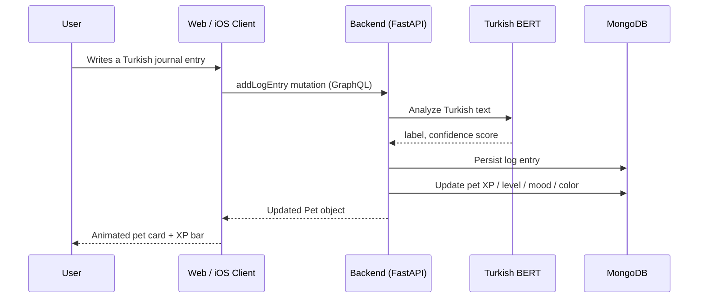

# AuraPet

A cross-platform journaling companion with a digital pet that responds to your mood. You write a short diary entry in Turkish, a sentiment model on the backend reads it, and your pet updates its mood, color theme, and XP accordingly. A single GraphQL API serves both the Next.js web app and the native SwiftUI iOS client.

<p align="left">
  
  
  
  
  
  
  
</p>

## Overview

- Turkish sentiment analysis runs on the backend using `saribasmetehan/bert-base-turkish-sentiment-analysis` (3-class). The model loads once at startup on Apple MPS or CPU, so the client never carries it.
- A single `addLogEntry` mutation persists the entry and updates the pet's mood, color theme, XP, and level in one pass.
- XP is awarded for emotional intensity rather than positivity, across five levels.
- Web and iOS share the same GraphQL queries and mutations.
- The Aurion design system provides a procedural vector pet (five shapes: Aether, Drift, Glimmer, Nova, Spark) with Lottie mood animations on both platforms.
- Sentiment history is charted with Recharts on web and the native Charts framework on iOS.
- Web includes a `cmdk` command palette (`⌘K`) and light/dark theming via `next-themes`; iOS mirrors theming with `@AppStorage`.
- Tests cover all three platforms: pytest (backend), vitest (web), and XCTest (iOS), wired into GitHub Actions CI and a local pre-commit config.

## Architecture



### Tech stack

| Layer | Technology | Version |
|-------|-----------|---------|
| Backend | Python, FastAPI, Strawberry GraphQL, Motor (async MongoDB) | 0.115 / 0.243 / 3.7 |
| AI / NLP | PyTorch, HuggingFace Transformers, `saribasmetehan/bert-base-turkish-sentiment-analysis` | — |
| Database | MongoDB | 7+ |
| Web | Next.js (App Router), React, Apollo Client, Tailwind CSS v4, Framer Motion, Recharts, Lottie, Radix UI | 16.2 / 19.2 / 3.14 |
| iOS | Swift / SwiftUI, custom AuraGraphQL HTTP client, Charts, Lottie, Keychain | iOS 17+ |
| Tooling | ruff, mypy, black (backend); ESLint, TypeScript, vitest (web); XCTest, xcodebuild (iOS) | — |
| CI/CD | GitHub Actions (ubuntu-latest + macos-15), pre-commit | — |

## Sentiment and mood engine

The backend maps each entry to one of four moods based on the model score:

| Mood | Emoji | Color | Hex | Score range |
|------|-------|-------|-----|-------------|
| HAPPY | 😊 | Gold | `#FFD700` | `score > 0.25` |
| NEUTRAL | 😐 | Slate | `#95A5A6` | `-0.25 ≤ score ≤ 0.25` |
| SAD | 😢 | Blue | `#5B9BD5` | `-0.65 ≤ score < -0.25` |
| ANXIOUS | 😰 | Purple | `#9B59B6` | `score < -0.65` |

`score` maps model confidence to `[-1.0, +1.0]`: positive becomes `+conf`, negative becomes `-conf`, neutral is `0.0`.

### XP formula

```
xp_gain = 10 + abs(score) × 20   →   range: 10 – 30 XP per entry
```

XP reflects emotional intensity, not positivity: a deeply anxious day yields the same XP as a very happy one, and every entry earns at least 10 XP.

### Level thresholds

| Level | Total XP required |
|-------|------------------|
| 1 → 2 | 100 |
| 2 → 3 | 250 |
| 3 → 4 | 500 |
| 4 → 5 | 900 |
| Max | 5 |

## Quick start

### Prerequisites

| Requirement | Version |
|------------|---------|
| Python | 3.9+ |
| Node.js | 20+ |
| MongoDB | Running locally |
| Xcode | 16+ (iOS only, optional) |

### Run everything

```bash
# 1. Start MongoDB
brew services start mongodb-community

# 2. Boot backend (:8000) and web (:3000) together
bash dev.sh
```

### Service URLs

| Service | URL |
|---------|-----|
| Web app | http://localhost:3000 |
| GraphQL playground | http://localhost:8000/graphql |
| REST health check | http://localhost:8000/api/health |
| REST analyze | `POST` http://localhost:8000/api/analyze |

### iOS

```bash
cd mobile-ios
xcodegen generate          # generates AuraPet.xcodeproj
open AuraPet.xcodeproj      # build & run on Simulator
```

Point the app at `http://localhost:8000/graphql` for local development.

## Testing and quality

Each platform has its own suite. They run together in CI on every push.

| Platform | Runner | Command |
|----------|--------|---------|
| Backend | pytest | `cd backend && .venv/bin/pytest -v` |
| Web | vitest | `cd web && npm test -- --run` |
| iOS | XCTest | `xcodebuild test -scheme AuraPet -destination 'platform=iOS Simulator,name=iPhone 16 Pro,OS=latest'` |

<details>
<summary>Full quality check suite</summary>

```bash
# ── Backend ────────────────────────────────────────────────────────────
cd backend
source .venv/bin/activate
ruff check .
mypy app                # disallow_untyped_defs = true
pytest -v

# ── Web ────────────────────────────────────────────────────────────────
cd web
npm run lint
npx tsc --noEmit        # TypeScript strict check
npm test -- --run
npm run build           # production build

# ── iOS ────────────────────────────────────────────────────────────────
cd mobile-ios
xcodegen generate
xcodebuild test \
  -scheme AuraPet \
  -destination 'platform=iOS Simulator,name=iPhone 16 Pro,OS=latest'

# ── End-to-end smoke (backend must be running) ─────────────────────────
bash scripts/e2e-smoke.sh
```

</details>

Pre-commit hooks (`.pre-commit-config.yaml`) run ruff, mypy, ESLint, and Prettier before each commit. GitHub Actions (`.github/workflows/ci.yml`) runs the backend and web suites on ubuntu-latest and the iOS suite on macos-15.

## Project structure

```
AuraPet/
├── backend/                        # FastAPI + Strawberry GraphQL
│   ├── app/
│   │   ├── api/                    # REST: GET /health, POST /analyze
│   │   ├── core/                   # pydantic-settings Config
│   │   ├── db/                     # Motor async MongoDB wrapper + indexes
│   │   ├── graphql/                # Schema, Query, Mutation resolvers
│   │   ├── models/                 # Pydantic documents (User, Pet, Log)
│   │   └── services/               # SentimentService (Turkish BERT singleton)
│   ├── tests/                      # pytest suite, no DB dependency
│   └── pyproject.toml              # ruff + mypy + pytest-asyncio config
│
├── web/                            # Next.js 16 App Router
│   └── src/
│       ├── app/                    # Pages: login, dashboard, log, history
│       ├── components/
│       │   ├── ui/                 # Button, Card, Badge, EmptyState, …
│       │   ├── aurion/             # Shared Aurion Lottie + shape components
│       │   ├── MoodChart.tsx       # Recharts sentiment trend
│       │   ├── PetAvatar.tsx       # Lottie mood animation wrapper
│       │   ├── Sidebar.tsx         # Nav + command palette trigger
│       │   └── XpBar.tsx           # Framer Motion animated XP bar
│       ├── graphql/                # Apollo operations (queries + mutations)
│       └── lib/                    # Apollo client (errorLink), session, cn
│
├── mobile-ios/AuraPet/             # SwiftUI iOS client
│   ├── Components/
│   │   ├── Aurion/                 # AurionShape protocol + 5 vector shapes
│   │   ├── Controls/               # AuraButtonStyle, FloatingLabelField
│   │   ├── Display/                # AnimatedCounter, EmptyState, Skeleton, Toast, …
│   │   ├── Navigation/             # AuraTabBar, CommandSheet
│   │   └── Surfaces/               # AuroraBackground, Card, GlassCard
│   ├── Design/                     # Theme tokens: colors, spacing, typography,
│   │                               # radius, motion, haptics, elevation
│   ├── Models/                     # Pet, User, LogEntry, Mood, AurionForm
│   ├── Network/                    # ApolloClient, AuraPetAPI, Keychain, Session
│   │   └── Operations/             # GraphQL query strings
│   ├── Resources/Lottie/           # happy.json, neutral.json, sad.json, anxious.json
│   └── Views/                      # Dashboard, Log, History, Login, Splash, Settings
│
├── shared-docs/
│   ├── ARCHITECTURE.md             # System design deep-dive
│   ├── DEPLOY.md                   # Production deployment guide
│   └── DEMO.md                     # Guided demo script
│
├── scripts/
│   └── e2e-smoke.sh                # End-to-end curl/jq smoke tests
├── .github/workflows/ci.yml        # GitHub Actions CI (3-platform)
├── .pre-commit-config.yaml         # Local pre-commit quality gates
└── dev.sh                          # One-command local dev bootstrap
```

## Demo flow

1. Log in at `http://localhost:3000` with any username and email.
2. The dashboard auto-creates a pet, plays the Lottie animation for its current mood, and shows an animated XP bar toward the next level.
3. Add a journal entry in Turkish and watch the pet react:

   | Input | Mood | Color |
   |-------|------|-------|
   | `"Bugün harika hissediyorum!"` | 😊 HAPPY | Gold `#FFD700` |
   | `"Sıradan bir gündi."` | 😐 NEUTRAL | Slate `#95A5A6` |
   | `"Çok kötü hissediyorum."` | 😢 SAD | Blue `#5B9BD5` |
   | `"Her şeyden korkuyorum."` | 😰 ANXIOUS | Purple `#9B59B6` |

4. Open History for the Recharts sentiment trend and the full log list with mood chips.
5. The iOS app shows the same data through the same API, with the Aurion vector pet and native Charts.

## Production status

The three platforms are working and tested for local and demo use. The following items remain before an App Store submission:

| Item | Status | Notes |
|------|--------|-------|
| App icon (1024×1024 PNG) | Pending | Placeholder slot exists in `Assets.xcassets` |
| Apple Developer Team ID | Pending | Set `DEVELOPMENT_TEAM` in `mobile-ios/project.yml` |
| Production HTTPS backend URL | Pending | Set `AURAPET_GRAPHQL_URL` in the Release scheme |
| JWT authentication | Pending | `user_id` is currently passed as a GraphQL argument; tracked in `shared-docs/DEPLOY.md` |

See [`shared-docs/DEPLOY.md`](shared-docs/DEPLOY.md) for the full deployment guide.

## Further reading

- [`shared-docs/ARCHITECTURE.md`](shared-docs/ARCHITECTURE.md) — system design deep-dive
- [`shared-docs/DEMO.md`](shared-docs/DEMO.md) — guided demo script

## License

[MIT](LICENSE) © Yiğit Erdoğan
